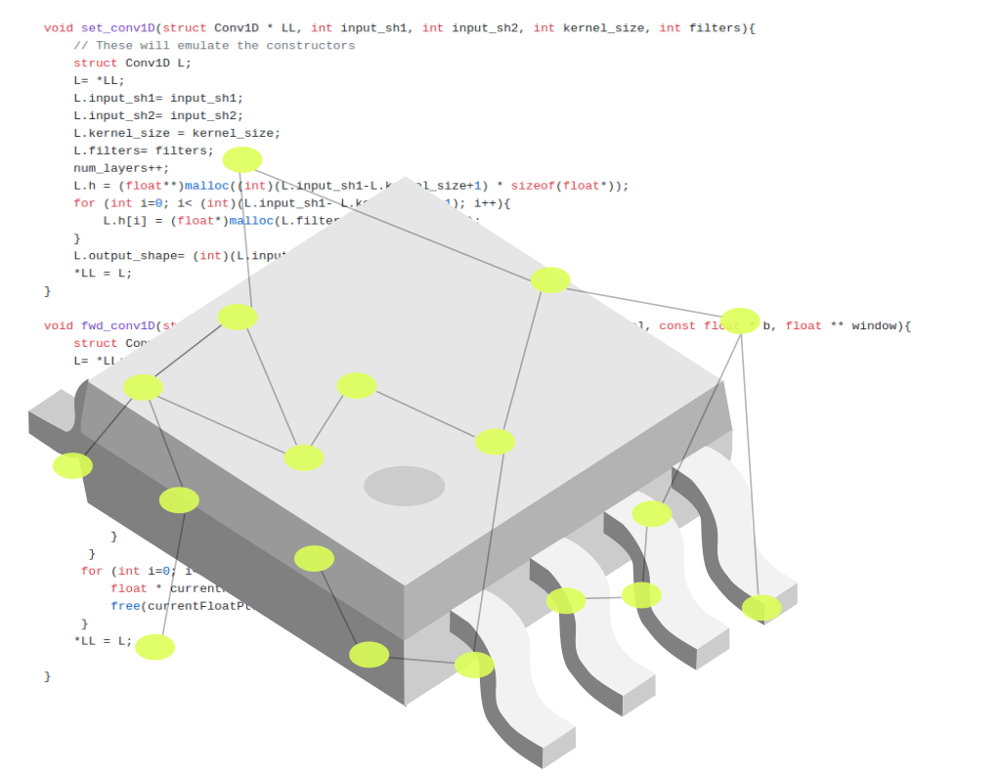




# nn4mc: Neural Networks for Microcontrollers

[](https://nn4mc.readthedocs.io/en/latest/)
[](https://github.com/correlllab/nn4mc/blob/master/LICENSE.md)

##### By the Correll Lab, University of Colorado Boulder

This repository is a generalization of the [esp 32 neural network](https://github.com/danathughes/esp32_neural_net) created by Dana Hughes.

In multiple areas of our research, we become interested in online estimation through regression or classification. Specifically, we found the need to be able to flash a microcontroller with a neural network model (which we trained offline, in a more capable computer) with a code that is easy to use, reusable and high performance for a microcontroller.  

This library is intended to be used in any microcontroller that supports C code after the neural network has been trained in a machine with Keras, Tensorflow, etc. and the parameters are saved. This enables the microcontroller to make online predictions. It is compatible with any freeRTOS code, the ESP32 and Arduino systems.

### More Information

- [Documentation](https://nn4mc.readthedocs.io/en/latest/)
- [Installation Instructions]()
- [Tutorials](https://github.com/correlllab/nn4mc/tree/master/examples)


### Technical Questions

Please direct your technical questions to [Stack Overflow](https://stackoverflow.com) using the [nn4mc](https://stackoverflow.com/questions/tagged/nn4mc) tag or e-mail Sarah.AguasvivasManzano@colorado.edu. Also feel free to initiate a new issue in our github repository.

### Getting Involved

- For bug report or feature requests please submit a [GitHub issue](https://github.com/correlllab/nn4mc/issues).
- For contributions please submit a [pull request](https://github.com/correlllab/nn4mc/pulls)


### Citing nn4mc:

We encourage to use the following citation references for academic use of nn4mc.

**BibTeX citation:**

```
TBD
```

**APA Format:**

```
Aguasvivas Manzano, S., Hughes, D., Simpson, C., Patel, R., Correll, N., (2019). International Sympsium on Robotics Research (ISRR 2019). 
```


### Contributors:

nn4mc is supported by the [Correll Lab](http://correll.cs.colorado.edu/) at the University of Colorado Boulder. The specific contributors will be listed in a website somewhere in the near future. We also receive support from the Airforce Office of Scientific Research (AFOSR), we are very grateful for this support. 

